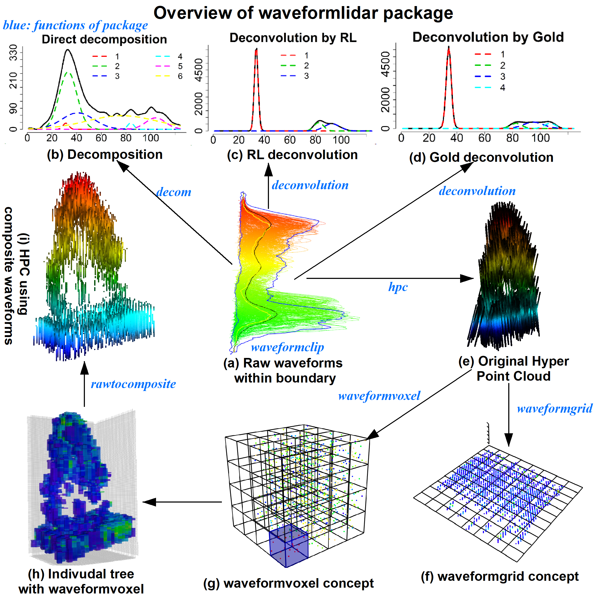

# Open Source Contributions

## LiDAR Data Processing & Analysis

### Waveformlidar R Package
{ align=right width="30%" }

An R package dedicated to Full Waveform (FW) LiDAR data processing, analysis, and visualization. Provides tools for waveform decomposition, metrics extraction, and point cloud generation.

[Learn More](waveformlidar_r_package.md)

### Tree Segmentation Algorithm (not finised)
{ align=right width="30%" }

Developed advanced algorithms for individual tree detection and segmentation using LiDAR point cloud data, incorporating machine learning techniques for improved accuracy.

[Learn More](tree_segmentation.md)