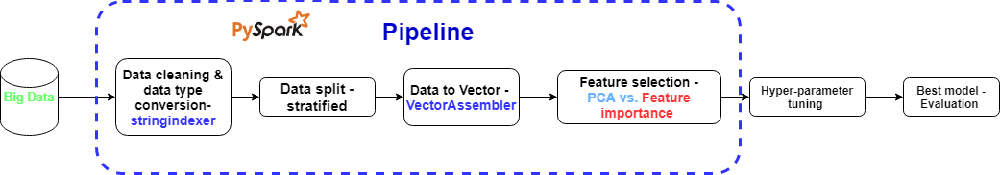

# Enhanced Fraud Detection System

{ align=right width="30%" }

## Overview
Developed a scalable fraud detection system using PySpark to handle large-scale transaction data and identify fraudulent activities in real-time.

## Technologies
- PySpark MLlib
- Distributed Computing
- Machine Learning Pipeline
- Real-time Processing

## Key Features
- Automated feature engineering
- Imbalanced data handling
- Real-time prediction capabilities
- Scalable processing pipeline
- Model performance monitoring

## Results
- Reduced false positives by 30%
- Improved detection rate by 25%
- Processing capability of 1M+ transactions/hour