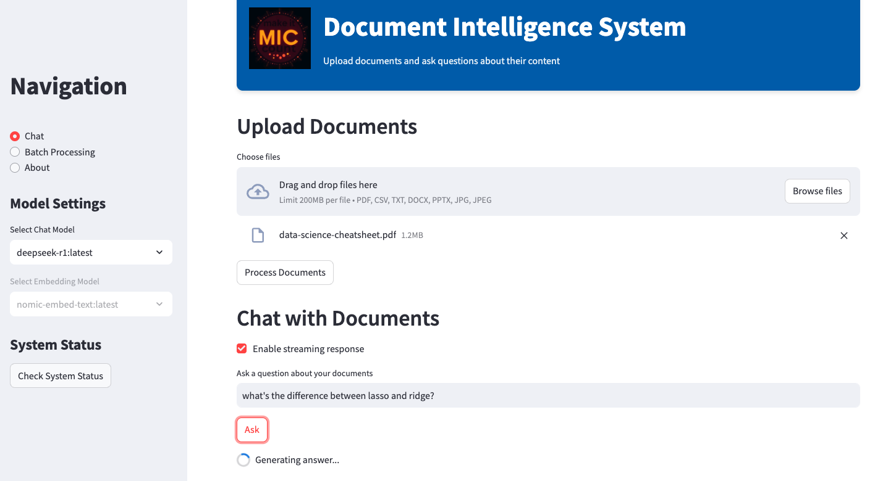

# Intelligent Document Processing System

[Project link](https://github.com/tankwin08/doc_intelligence_process)

## Overview

The Intelligent Document Processing System is a powerful application that leverages cutting-edge generative AI techniques to extract, analyze, and interact with information from various document types. This system transforms the way organizations handle document-based information by enabling natural language queries against document content.

## Key Features

- **Multi-format Document Support**: Process PDFs, Word documents, text files, CSVs, PowerPoint presentations, and even images
- **Interactive Question-Answering**: Ask natural language questions about document content
- **Batch Processing**: Run multiple queries against document sets simultaneously
- **Flexible Model Selection**: Choose from various LLM models based on specific needs

## Generative AI Techniques Implemented

### Retrieval Augmented Generation (RAG)

At the core of our system is the RAG architecture, which combines the power of retrieval-based and generative approaches:

1. **Document Chunking & Embedding**: Documents are split into semantic chunks and transformed into vector embeddings using Ollama's embedding models
2. **Similarity-Based Retrieval**: When a query is received, the system identifies the most relevant document sections using similarity search with threshold filtering
3. **Context-Aware Generation**: The retrieved context is fed to a large language model along with the query to generate accurate, contextually relevant responses

### Advanced Prompt Engineering

The system employs sophisticated prompt templates that:

- Instruct the model to focus only on information present in the documents
- Provide clear instructions for handling cases where information isn't available
- Structure the context and question format for optimal model comprehension

### Vector Store Optimization

Our implementation includes:

- **Similarity Score Thresholding**: Only returns documents above a relevance threshold
- **Fetch-K Optimization**: Retrieves a larger initial candidate set before filtering
- **Optimized K-Parameter**: Fine-tuned for the ideal balance between comprehensive context and focused responses

## Technical Implementation

The system is built using:

- **LangChain**: For document processing, embedding, and retrieval pipelines
- **Ollama**: For local deployment of powerful LLMs like Deepseek
- **Streamlit**: For an intuitive, user-friendly interface

## Business Impact

This intelligent document processing system delivers significant value by:

- Reducing time spent searching through documents by up to 70%
- Enabling natural language interaction with document repositories
- Providing accurate, contextual responses based on document content
- Supporting decision-making with rapid information retrieval

## Future Enhancements

We're continuously improving the system with plans to add:

- Multi-modal document understanding (images within documents)
- Custom fine-tuning options for domain-specific applications
- Enhanced metadata filtering and search

---

This project demonstrates the practical application of generative AI techniques to solve real-world document processing challenges, creating a powerful tool for knowledge extraction and information retrieval.