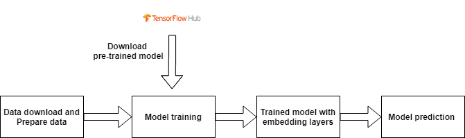

# Sentiment analysis for review classification using SWIVEL and a small datasets

**Introduction:**
[project link](https://github.com/tankwin08/sentiment_analysis_SWIVEL)

Genealy, it require an amount of data to train and a long time to train a NLP model for a specific dataset. 
Transfer learning is commonly used in this case to conduct the sentiment analsis for Natural Language Processing (NLP) problem.

Swivel performs approximate factorization of the point-wise mutual information matrix via stochastic gradient descent. 
It uses a piecewise loss with special handling for unobserved co-occurrences, and thus makes use of all the information in the matrix.

###  [Pretrained Word Embeddings](https://www.analyticsvidhya.com/blog/2020/03/pretrained-word-embeddings-nlp/)

Pretrained Word Embeddings are the embeddings learned in one task that are used for solving another similar task.

These embeddings are trained on large datasets, saved, and then used for solving other tasks. That’s why pretrained word embeddings are a form of Transfer Learning.

CBOW (Continuous Bag Of Words) and Skip-Gram are two most popular frames for word embedding. In CBOW the words occurring in context (surrounding words) of a selected word are used as inputs and middle or selected word as the target. Its the other way round in Skip-Gram, here the middle word tries to predict the words coming before and after it.

**Why do we need Pretrained Word Embeddings?**

Pretrained word embeddings capture the semantic and syntactic meaning of a word as they are trained on large datasets. They are capable of boosting the performance of a Natural Language Processing (NLP) model. These word embeddings come in handy during hackathons and of course, in real-world problems as well.

But why should we not learn our own embeddings? Well, learning word embeddings from scratch is a challenging problem due to two primary reasons:

* 1 Sparsity of training data

* 2 Large number of trainable parameters