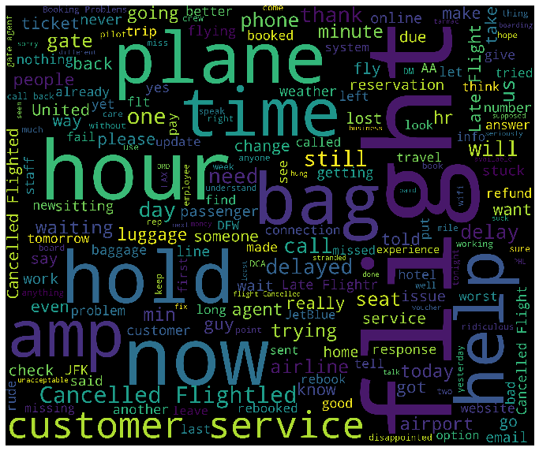

# Airline Sentiment Analysis

{ align=right width="30%" }

## Overview
Developed a sentiment analysis model to analyze customer feedback from airline tweets, classifying sentiments as positive, neutral, or negative.

## Technologies Used
- BERT for text classification
- Python (scikit-learn, transformers)
- Natural Language Processing
- Data Visualization (WordCloud)

## Key Features
- Pre-trained BERT model fine-tuning
- Multi-class sentiment classification
- Real-time sentiment prediction
- Interactive visualization dashboard
- Comparative model performance analysis

## Results
- Achieved 87% accuracy in sentiment classification
- Successfully identified key customer pain points
- Generated actionable insights for service improvement